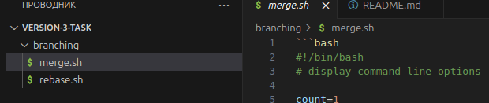
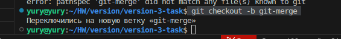
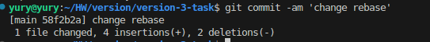
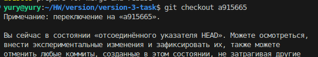
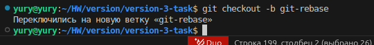

# Домашнее задание к занятию «Ветвления в Git» Шелухин Юрий

### Цель задания

В процессе работы над заданием вы потренеруетесь делать merge и rebase. В результате вы поймете разницу между ними и научитесь решать конфликты.   
Обычно при нормальном ходе разработки выполнять `rebase` достаточно просто. 
Это позволяет объединить множество промежуточных коммитов при решении задачи, чтобы не засорять историю. Поэтому многие команды и разработчики предпочитают такой способ.   


### Инструкция к заданию

1. В личном кабинете отправьте на проверку ссылку на network графика вашего репозитория.
2. Любые вопросы по решению задач задавайте в чате учебной группы.


### Дополнительные материалы для выполнения задания

* Тренажёр [LearnGitBranching](https://learngitbranching.js.org/), где можно потренироваться в работе с деревом коммитов и ветвлений. 

------

## 1. Задание «Ветвление, merge и rebase»  

**Шаг 1.** Предположим, что есть задача — написать скрипт, выводящий на экран параметры его запуска. 
Давайте посмотрим, как будет отличаться работа над этим скриптом с использованием ветвления, merge и rebase. 

Создайте в своём репозитории каталог `branching` и в нём два файла — `merge.sh` и `rebase.sh` — с 
содержимым:

```bash
#!/bin/bash
# display command line options

count=1
for param in "$*"; do
    echo "\$* Parameter #$count = $param"
    count=$(( $count + 1 ))
done
```

Этот скрипт отображает на экране все параметры одной строкой, а не разделяет их.

**Шаг 2.** Создадим коммит с описанием `prepare for merge and rebase` и отправим его в ветку main. 

--- 


#### 2. Подготовка файла merge.sh 
 
**Шаг 1.** Создайте ветку `git-merge`. 

**Шаг 2**. Замените в ней содержимое файла `merge.sh` на:

```bash
#!/bin/bash
# display command line options

count=1
for param in "$@"; do
    echo "\$@ Parameter #$count = $param"
    count=$(( $count + 1 ))
done
```

**Шаг 3.** Создайте коммит `merge: @ instead *`, отправьте изменения в репозиторий.  
**Шаг 4.** Разработчик подумал и решил внести ещё одно изменение в `merge.sh`:
 
```bash
#!/bin/bash
# display command line options

count=1
while [[ -n "$1" ]]; do
    echo "Parameter #$count = $1"
    count=$(( $count + 1 ))
    shift
done
```

Теперь скрипт будет отображать каждый переданный ему параметр отдельно. 

**Шаг 5.** Создайте коммит `merge: use shift` и отправьте изменения в репозиторий. 

#### Изменим main  

**Шаг 1.** Вернитесь в ветку `main`. 
**Шаг 2.** Предположим, что пока мы работали над веткой `git-merge`, кто-то изменил `main`. Для этого
изменим содержимое файла `rebase.sh` на:

```bash
#!/bin/bash
# display command line options

count=1
for param in "$@"; do
    echo "\$@ Parameter #$count = $param"
    count=$(( $count + 1 ))
done

echo "====="
```

В этом случае скрипт тоже будет отображать каждый параметр в новой строке. 

**Шаг 3.** Отправляем изменённую ветку `main` в репозиторий.

---


#### 3.Подготовка файла rebase.sh  

**Шаг 1.** Предположим, что теперь другой участник нашей команды не сделал `git pull` либо просто хотел ответвиться не от последнего коммита в `main`, а от коммита, когда мы только создали два файла
`merge.sh` и `rebase.sh` на первом шаге.  
Для этого при помощи команды `git log` найдём хеш коммита `prepare for merge and rebase` и выполним `git checkout` на него так:
`git checkout 8baf217e80ef17ff577883fda90f6487f67bbcea` (хеш будет другой).
**Шаг 2.** Создадим ветку `git-rebase`, основываясь на текущем коммите. 
**Шаг 3.** И изменим содержимое файла `rebase.sh` на следующее, тоже починив скрипт, но немного в другом стиле:

```bash
#!/bin/bash
# display command line options

count=1
for param in "$@"; do
    echo "Parameter: $param"
    count=$(( $count + 1 ))
done

echo "====="
```

**Шаг 4.** Отправим эти изменения в ветку `git-rebase` с комментарием `git-rebase 1`.

**Шаг 5.** И сделаем ещё один коммит `git-rebase 2` с пушем, заменив `echo "Parameter: $param"` на `echo "Next parameter: $param"`.

#### 4. Промежуточный итог  

Мы сэмулировали типичную ситуации в разработке кода, когда команда разработчиков работала над одним и тем же участком кода, и кто-то из разработчиков предпочитает делать `merge`, а кто-то — `rebase`. Конфликты с merge обычно решаются просто, 
а с rebase бывают сложности, поэтому давайте смержим все наработки в `main` и разрешим конфликты. 
Если всё было сделано правильно, то на странице `network` в GitHub, находящейся по адресу 
`https://github.com/ВАШ_ЛОГИН/ВАШ_РЕПОЗИТОРИЙ/network`, будет примерно такая схема:
  


#### 5. Merge

Сливаем ветку `git-merge` в main и отправляем изменения в репозиторий, должно получиться без конфликтов:

```bash
$ git merge git-merge
Merge made by the 'recursive' strategy.
 branching/merge.sh | 5 +++--
 1 file changed, 3 insertions(+), 2 deletions(-)
$ git push
#!/bin/bash
Enumerating objects: 1, done.
Counting objects: 100% (1/1), done.
Writing objects: 100% (1/1), 223 bytes | 223.00 KiB/s, done.
Total 1 (delta 0), reused 0 (delta 0), pack-reused 0
```  

В результате получаем такую схему:
  


---

#### 6. Rebase

**Шаг 1.** Перед мержем ветки `git-rebase` выполним её `rebase` на main. Да, мы специально создали ситуацию с конфликтами, чтобы потренироваться их решать. 
**Шаг 2.** Переключаемся на ветку `git-rebase` и выполняем `git rebase -i main`. 
В открывшемся диалоге должно быть два выполненных коммита, давайте заодно объединим их в один, 
указав слева от нижнего `fixup`. 
В результате получаем:

```bash
$ git rebase -i main
Auto-merging branching/rebase.sh
CONFLICT (content): Merge conflict in branching/rebase.sh
error: could not apply dc4688f... git 2.3 rebase @ instead *
Resolve all conflicts manually, mark them as resolved with
"git add/rm <conflicted_files>", then run "git rebase --continue".
You can instead skip this commit: run "git rebase --skip".
To abort and get back to the state before "git rebase", run "git rebase --abort".
Could not apply dc4688f... git 2.3 rebase @ instead *
``` 

Если посмотреть содержимое файла `rebase.sh`, то увидим метки, оставленные Git для решения конфликта:

```bash
cat rebase.sh
#!/bin/bash
# display command line options
count=1
for param in "$@"; do
<<<<<<< HEAD
    echo "\$@ Parameter #$count = $param"
=======
    echo "Parameter: $param"
>>>>>>> dc4688f... git 2.3 rebase @ instead *
    count=$(( $count + 1 ))
done
```

**Шаг 3.** Удалим метки, отдав предпочтение варианту:

```bash
echo "\$@ Parameter #$count = $param"
```

**Шаг 4.** Сообщим Git, что конфликт решён `git add rebase.sh` и продолжим rebase `git rebase --continue`.

**Шаг 5.** Опять получим конфликт в файле `rebase.sh` при попытке применения нашего второго коммита. Давайте разрешим конфликт, оставив строчку `echo "Next parameter: $param"`.

**Шаг 6.** Далее опять сообщаем Git о том, что конфликт разрешён — `git add rebase.sh` — и продолжим rebase — `git rebase --continue`.

В результате будет открыт текстовый редактор, предлагающий написать комментарий к новому объединённому коммиту:

```
# This is a combination of 2 commits.
# This is the 1st commit message:

Merge branch 'git-merge'

# The commit message #2 will be skipped:

# git 2.3 rebase @ instead * (2)
```

Все строчки, начинающиеся на `#`, будут проигнорированны. 

После сохранения изменения Git сообщит:

```
Successfully rebased and updated refs/heads/git-rebase
```

**Шаг 7.** И попробуем выполнить `git push` либо `git push -u origin git-rebase`, чтобы точно указать, что и куда мы хотим запушить. 

Эта команда завершится с ошибкой:

```bash
git push
To github.com:andrey-borue/devops-netology.git
 ! [rejected]        git-rebase -> git-rebase (non-fast-forward)
error: failed to push some refs to 'git@github.com:andrey-borue/devops-netology.git'
hint: Updates were rejected because the tip of your current branch is behind
hint: its remote counterpart. Integrate the remote changes (e.g.
hint: 'git pull ...') before pushing again.
hint: See the 'Note about fast-forwards' in 'git push --help' for details.
```

Это произошло, потому что мы пытаемся перезаписать историю. 

**Шаг 8.** Чтобы Git позволил нам это сделать, добавим флаг `force`:

```bash
git push -u origin git-rebase -f
Enumerating objects: 10, done.
Counting objects: 100% (9/9), done.
Delta compression using up to 12 threads
Compressing objects: 100% (4/4), done.
Writing objects: 100% (4/4), 443 bytes | 443.00 KiB/s, done.
Total 4 (delta 1), reused 0 (delta 0), pack-reused 0
remote: Resolving deltas: 100% (1/1), completed with 1 local object.
To github.com:andrey-borue/devops-netology.git
 + 1829df1...e3b942b git-rebase -> git-rebase (forced update)
Branch 'git-rebase' set up to track remote branch 'git-rebase' from 'origin'.
```

**Шаг 9**. Теперь можно смержить ветку `git-rebase` в main без конфликтов и без дополнительного мерж-комита простой перемоткой: 

```
$ git checkout main
Switched to branch 'main'
Your branch is up to date with 'origin/main'.

$ git merge git-rebase
Updating 6158b76..45893d1
Fast-forward
 branching/rebase.sh | 3 +--
 1 file changed, 1 insertion(+), 2 deletions(-)
```

*В качестве результата работы по всем заданиям приложите ссылку на .md-файл в вашем репозитории.*
 
----


### Правила приёма домашнего задания

В личном кабинете отправлена ссылка на network графика вашего репозитория.

### Критерии оценки

Зачёт:

* выполнены все задания;
* ответы даны в развёрнутой форме;
* приложены соответствующие скриншоты и файлы проекта;
* в выполненных заданиях нет противоречий и нарушения логики.

На доработку:

* задание выполнено частично или не выполнено вообще;
* в логике выполнения заданий есть противоречия и существенные недостатки.  
* 
---
 


## Решение 1.

### Создание аккаунта в GitLab.

1. Зврегистрируемся в Gitlab.  

    

2-4. Создадим новый проект.

   
   
   

5. Перейдем на страницу созданного репозитория и изучим предлагаемые варианты для начала работы в репозитории в секции `Command line instructions`.     

  

6. Изучим команду `git remote -v`.  

  

Данная команда покажет список подключенных удаленных репозиториев.  

7. Добавим репозиторий gitlab, как дополнительный `remote`, к созданному репозиторию в рамках предыдущего домашнего задания:
`git remote add gitlab git@gitlab.com:yuryshelukhin-group/version-2.git`  
Затем просмотрим список подключенных репозиториев `git remote -v`.


Чтобы "пушить" на gitlab сделаем публичными последовательно на gitlab свою группу и репозиторий. Также установим для себя пароль на сайте gitlab.  


Чтобы не использовать SSH, привяжем remote на HTTPS.  
`git remote set-url gitlab https://gitlab.com/yuryshelukhin-group/version-2.git`

8. Сделаем изменения в файле README.md и закомиттим его. Далее отправим изменения в новый удалённый репозиторий `git push -gitlab main`.


9. Проверим вывод команды `git remote -v`


Также проверим факт выгрузки на gitlab.


---


## Задание 2. Теги

Представьте ситуацию, когда в коде была обнаружена ошибка — надо вернуться на предыдущую версию кода,
исправить её и выложить исправленный код в продакшн. Мы никуда не будем выкладывать код, но пометим некоторые коммиты тегами и создадим от них ветки. 

1. Создайте легковестный тег `v0.0` на HEAD-коммите и запуште его во все три добавленных на предыдущем этапе `upstream`.
2. Аналогично создайте аннотированный тег `v0.1`.
3. Перейдите на страницу просмотра тегов в GitHab (и в других репозиториях) и посмотрите, чем отличаются созданные теги. 
    * в GitHub — https://github.com/YOUR_ACCOUNT/devops-netology/releases;
    * в GitLab — https://gitlab.com/YOUR_ACCOUNT/devops-netology/-/tags;
    * в Bitbucket — список тегов расположен в выпадающем меню веток на отдельной вкладке. 

---

### Решение 2.  

1. Создадим легковестный тег `v0.0` на HEAD-коммите:  
`git tag v0.0`    

  

и запушим его в обе удаленные ветки.   

  
  
 
2.  Создадим аннотированный тег `v0.1`.    
`git tag -a v0.1 -m 'annotated tag'`    
Проверим список тегов.    

  

и вновь запушим тег в обе удаленные ветки.  

3. Перейдем на страницы просмотра тегов в Github и Gitlab для изучения.   

  
  
  
  
  

---


## Задание 3. Ветки   

Давайте посмотрим, как будет выглядеть история коммитов при создании веток.   
1. Переключитесь обратно на ветку `main`, которая должна быть связана с веткой `main` репозитория на `github`.  
2. Посмотрите лог коммитов и найдите хеш коммита с названием `Prepare to delete and move`, который был создан в пределах предыдущего домашнего задания.   
3. Выполните `git checkout` по хешу найденного коммита.   
4. Создайте новую ветку `fix`, базируясь на этом коммите `git switch -c fix`.  
5. Отправьте новую ветку в репозиторий на GitHub `git push -u origin fix`.  
6. Посмотрите, как визуально выглядит ваша схема коммитов: https://github.com/YOUR_ACCOUNT/devops-netology/network.   
7. Теперь измените содержание файла `README.md`, добавив новую строчку.  
8. Отправьте изменения в репозиторий и посмотрите, как изменится схема на странице https://github.com/YOUR_ACCOUNT/devops-netology/network и как изменится вывод команды `git log`.  

### Решение 3.  

1-2. Просмотрим список коммитов `git log --oneline`. Найдем хеш коммита с названием `Prepare to delete and move`  
   
    

3. Переключимся на этот коммит.    
`git checkout e98d966`    

    

4. Создадим новую ветку.    
`git switch -c fix`      

  

5. Отправим новую ветку в репозиторий на GitHub `git push -u origin fix`.  

  

6.  Посмотрим визуально схему коммитов.     

    

7. Изменим содержание файла `README.md`, добавив новую строчку, и отправим изменения в репозиторий.  

`git commit -am 'fix +change'`  
`git push -u origin fix`  

  

8. Посмотрим, как изменилась схема на странице Github и как изменил вывод команды `git log`.    

    
    

---


## Задание 4. Упрощаем себе жизнь  

Попробуем поработь с Git при помощи визуального редактора.   
1. В используемой IDE PyCharm откройте визуальный редактор работы с Git, находящийся в меню View -> Tool Windows -> Git.  
2. Измените какой-нибудь файл, и он сразу появится на вкладке `Local Changes`, отсюда можно выполнить коммит, нажав на кнопку внизу этого диалога.   
3. Элементы управления для работы с Git будут выглядеть примерно так:  
  
4. Попробуйте выполнить пару коммитов, используя IDE.   
[По ссылке](https://www.jetbrains.com/help/pycharm/commit-and-push-changes.html) можно найти справочную информацию по визуальному интерфейсу.   
Если вверху экрана выбрать свою операционную систему, можно посмотреть горячие клавиши для работы с Git.   
Подробней о визуальном интерфейсе мы расскажем на одной из следующих лекций.  
*В качестве результата работы по всем заданиям приложите ссылки на ваши репозитории в GitHub, GitLab и Bitbucket*.    
 

### Решение 4.  

1. Для проверки возможностей работы с Git в визуальном редакторе (я использую VSCode) изменим файл README.md.      
   
       
     

2. Выполним коммит с помощью интерфейса VScode.  

  

3. Изучим какие еще возможности предоставляет VScode: можно нажатием кнопок переходить между веткамии и между коммитами, вытягивать и отправлять информацию в удаленный репозиторий, просматривать изменения файлов, делать коммит с добавлением комментариев и т.д.    

    
    
    

4. Проверим фактическую выгрузку измений в удаленный репозиторий.   
   
  
  

* ссылки на удаленные репозитории:  
* https://github.com/YuryShelukhin/version-1  
* https://gitlab.com/yuryshelukhin-group/version-2
   


